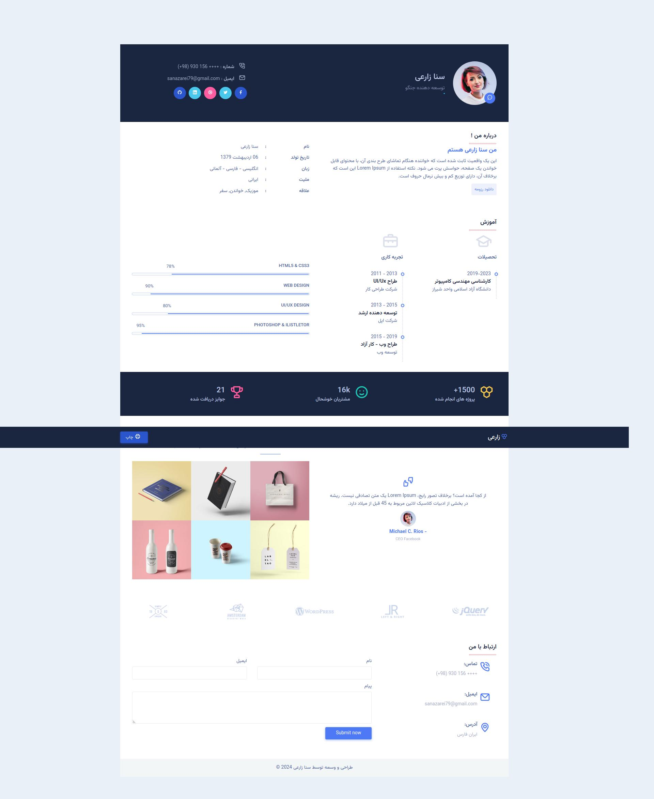

# رزومه سنا زارعی
### رزومه Responsive وبسایت CV با استفاده از HTML، CSS و جاوا اسکریپت

- استفاده از منوی ناوبری با آیکون‌ها برای موبایل
- پیاده‌سازی اسکرول روان
- تست و بهینه‌سازی برای دستگاه‌های موبایل
- دارای دکمه پرینت
  
 ### لیست کارهای قابل انجام :
<ul style="list-style-type:none;" dir="rtl">
    <li><input type="checkbox" checked disabled> - [x] انتشار نسخه اولیه وبسایت </li>
    <li><input type="checkbox" checked> - [ ] ‌بهینه سازی پرینت </li>
    <li><input type="checkbox" checked> - [ ] بهینه‌سازی برای SEO </li>
    <li><input type="checkbox" checked> - [ ] بهینه‌سازی عملکرد وبسایت </li>
    <li><input type="checkbox" checked> - [ ] به‌روزرسانی مداوم محتوا </li>
</ul>

  <strong>حالت دسکتاپ</strong>

  

  <strong>حالت موبایل</strong>

  

